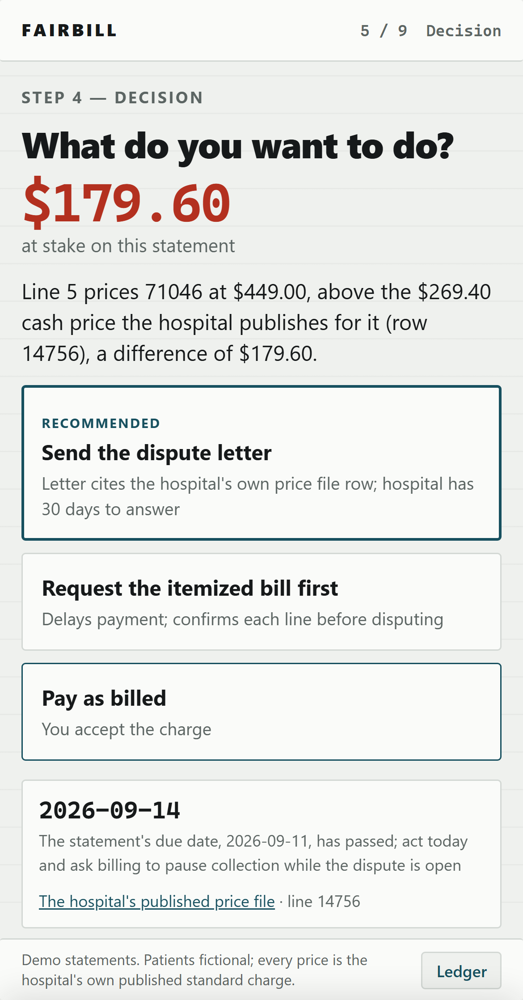
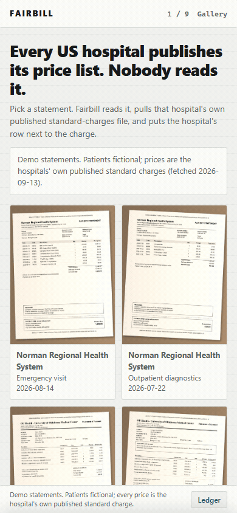
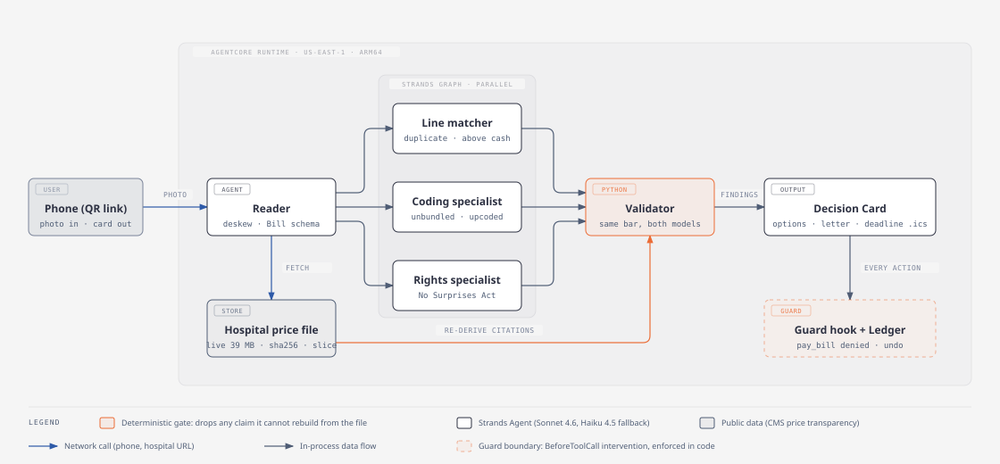
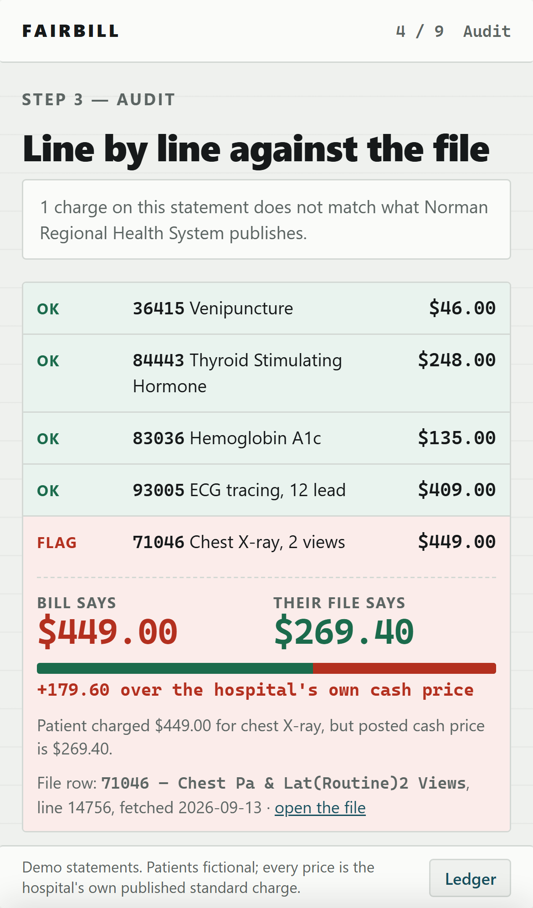
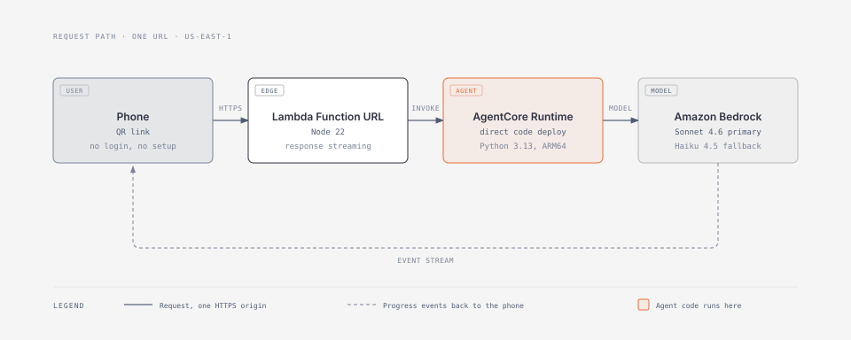

# Fairbill

**Reads your hospital bill, downloads the hospital's own published price file, and puts their posted price next to every charge.**

[](https://strandsagents.com/) [](https://docs.aws.amazon.com/bedrock-agentcore/latest/devguide/what-is-bedrock-agentcore.html) [](LICENSE) [](https://waixxctuxe5ojzlndpci5wvpqi0bixad.lambda-url.us-east-1.on.aws/)




<b>Scan it, or open the link:</b><br>
<a href="https://waixxctuxe5ojzlndpci5wvpqi0bixad.lambda-url.us-east-1.on.aws/">waixxctuxe5ojzlndpci5wvpqi0bixad.lambda-url.us-east-1.on.aws</a>

No login. No install. No upload of your own data. Pick a demo bill and watch the whole run.

Built for the AWS "Agents for Humans" hackathon, Everyday track.

<br clear="all">



*Real screen capture of the live link above, an 18 s time-lapse of a 238 s live run. Statement read, price file fetched live (sha256 shown), flagged row, Decision Card, drafted letter, then "just pay it" and the guard denying pay_bill.*

Not legal advice. See the statement at the bottom of this file.

## Architecture at a glance



## The problem

[41% of US adults carry debt from medical or dental bills](https://www.kff.org/health-costs/kff-health-care-debt-survey/) (KFF Health Care Debt Survey, fielded February to March 2022). Of those, [51% say cost stopped them getting a test or treatment a doctor recommended](https://www.kff.org/health-costs/americans-challenges-with-health-care-costs/).

The document that could help already exists. [45 CFR 180.50](https://www.ecfr.gov/current/title-45/part-180) has required every US hospital to publish a machine-readable file of its own prices [since January 1, 2021](https://www.cms.gov/priorities/key-initiatives/hospital-price-transparency). The files are public, free, and sitting on the hospital's website right now. Norman Regional Health System's is 39,141,747 bytes and 151,439 lines. Almost nobody reads them.

There is a federal path to dispute a bill. CMS says you can use it when a provider [charged at least $400 more than their good faith estimate](https://www.cms.gov/medical-bill-rights/help/dispute-a-bill), and you have 120 calendar days from an initial bill. Using it means comparing your bill to the hospital's own posted price. That is the step Fairbill does for you.

## What it does

You photograph a hospital bill. Fairbill reads it, identifies the hospital, downloads that hospital's published standard-charges file live, and puts the hospital's posted price next to every line you were charged.

It checks five things: the same code billed twice, a lab panel split into its components, a visit level billed higher than the notes support, a charge above the hospital's posted cash price, and an out-of-network charge that federal law protects you from.

When it finds something, it shows the row. Bill line 5 says $449.00. The hospital's file, row 14756, says the cash price is $269.40. There is a link to the public file. Then it hands you one card: send the dispute letter, request the itemized bill first, or pay as billed. The letter is already drafted, cited to the regulation, and addressed.

If the bill is clean, it says so. That case is in the demo on purpose. An auditor that always finds something is not an auditor.

Fairbill never moves money. There are no payment fields anywhere in the product.

## Try it without your own bill

There is no public corpus of real patient bills, so the demo ships its own gallery. The patients are invented. The prices are not.

| # | Hospital | Statement | What is real | What is fictional |
|---|---|---|---|---|
| 1 | Norman Regional Health System | 8 lines, duplicate line item | Every code and price is a row in Norman's published standard-charges CSV | Patient "Jordan Sample", account number, dates of service, the planted duplicate |
| 2 | Norman Regional Health System | 5 lines, charge above the posted cash price | Same, including the cash price on file line 14756 | Patient "Casey Example", account number, dates, the planted overcharge |
| 3 | OU Health, University of Oklahoma Medical Center | 6 lines, unbundled lab panel | Panel and component rows from OU's published file | Patient "Riley Demo", account number, dates, the planted unbundling |
| 4 | OU Health, University of Oklahoma Medical Center | 6 lines, upcoded visit level | Both visit-level rows from OU's published file | Patient "Morgan Placeholder", account number, dates, the planted upcode |
| 5 | Norman Regional Health System | 3 lines, out-of-network anesthesia | The facility rows from Norman's file | Patient "Taylor Fictional", account number, dates, the planted out-of-network charge |
| 6 | Norman Regional Health System | 5 lines, clean | Every code and price is a real row | Patient "Alex Specimen", account number, dates |

Every generated page prints: "DEMO STATEMENT. Patient is fictional. Prices are the hospital's own published standard charges (fetched 2026-09-13)."

## How it works

**Reader.** A photo of a printed page arrives rotated by a few degrees. On a wide statement table, that shifts the right-hand money columns by a full row height. OpenCV finds the page quad and warps it flat before the model sees anything. No pixel content is invented. Two passes follow: a verbatim transcription, then a structured-output pass into a `Bill` schema. Deskew took the reader from 3 of 6 to 6 of 6 ([`evals/READER_ABLATION.md`](evals/READER_ABLATION.md)).

**Triage.** Hospital identification is tiered. A regex on the hospital name and EIN hits the local registry with no model call. A model is used only when the name is ambiguous.

**Price file.** Fairbill fetches the hospital's CMS v3.0.0 machine-readable file live, streaming, with a byte counter and a sha256 check against the committed fixture. If the fetch is slow or the endpoint is down, it falls back to the fixture and says on screen which one ran.

**Audit.** A Strands `Graph` runs three specialists in parallel: a line matcher, a coding specialist, and a rights specialist. Each proposes claims. A claim names codes and line numbers only. It never carries a price.



*Each flagged row names the code, the billed price, the hospital's posted price, and the row number in the hospital's file.*

**Validator.** A deterministic Python node re-derives every claim from the hospital's file. A duplicate must name exactly two lines carrying the same code and the same charge, and that code must have a row in the file. A claim that cannot be re-derived is dropped. No model text reaches a citation.

**Decision Card.** One card, built in Python with no model call. The situation, the amount at stake, up to three options with one recommended, the deadline, and a link to the evidence row. Duplicates and above-cash charges default to dispute. Unbundling defaults to requesting the itemized bill. Upcoding defaults to asking the provider. Out-of-network defaults to the No Surprises Act notice. A clean bill gets one option: close it.

**Letters.** The model writes the prose. Python owns every fact. Amounts, codes, file line numbers, and citations are supplied by Python and checked back after drafting. Citations are `45 CFR 180.50` for the price-file duty and [45 CFR 149.420](https://www.ecfr.gov/current/title-45/part-149/section-149.420) for No Surprises Act cases. Every letter carries a fixed footer saying the patient names are fictional and that this is not legal advice.

**Ledger and undo.** Every step is recorded. Every step can be undone, with a ten-minute veto window on anything that leaves the machine.

**Guard.** A Strands `InterventionHandler` sits in front of every tool call. It denies any call whose name or arguments touch payment, card-shaped digits, routing numbers, or signing. It is set to `on_error = "deny"`, so a broken guard fails closed. A decoy `pay_bill` tool exists to be denied on camera; its execution counter has never left zero. A separate redaction hook masks the patient name, account numbers, and card-length digit runs in every tool input, every tool result, and the reply.

**Same-bar fallback.** Primary model is `us.anthropic.claude-sonnet-4-6` on Amazon Bedrock (the US regional inference profile of Claude Sonnet 4.6; switched from the `global.` profile on 2026-09-14 after that profile returned daily token-quota throttles). Fallback is `us.anthropic.claude-haiku-4-5-20251001-v1:0`, in `us-east-1`. Both pass through the same validator, so the fallback cannot lower the evidence bar.

**Planned, not shipped.** Designed and not built; nothing in the demo depends on them: an MCP server exposing `audit_bill` to other agents `[PLANNED]`, AgentCore Memory for standing rules `[PLANNED]`, AgentCore Observability traces `[PLANNED]`, background re-auditing when the itemized bill arrives `[PLANNED]`.


## Deployment

An Amazon Bedrock AgentCore Runtime entrypoint (`BedrockAgentCoreApp`, `@app.entrypoint`) serves `/ping` and `/invocations`. It runs as an AgentCore Runtime direct-code deployment in `us-east-1` (Python 3.13, ARM64 zip, deployed with boto3 `create_agent_runtime` and `update_agent_runtime` from `deploy/deploy_runtime.py`). A Lambda Function URL in response-streaming mode (`deploy/lambda_proxy/index.mjs`, Node 22) serves the static page and forwards each call to the Runtime with `InvokeAgentRuntime`. One URL and one QR code cover the whole demo, and progress events stream back to the phone as the run happens.



## Bench

The six gallery bills are the bench. Ground truth lives in [`gallery/truth.json`](gallery/truth.json). [`evals/BENCH.md`](evals/BENCH.md) is the source of record.

Suite `truth` audits the bill as printed. Suite `e2e` reads the phone photo first, then audits what the reader produced. A Claude judge scores each drafted letter against the audit finding.

| bill | suite | planted | found | matched | false flags | letter score | reader exact | seconds |
| --- | --- | --- | --- | --- | --- | --- | --- | --- |
| bill_01 | e2e | 1 | 1 | 1/1 | 0 | 1.00 | yes | 565.8 |
| bill_01 | truth | 1 | 1 | 1/1 | 0 | 1.00 | - | 218.7 |
| bill_02 | e2e | 1 | 1 | 1/1 | 0 | 1.00 | yes | 166.2 |
| bill_02 | truth | 1 | 1 | 1/1 | 0 | 1.00 | - | 83.4 |
| bill_03 | e2e | 1 | 1 | 1/1 | 0 | 1.00 | yes | 194.1 |
| bill_03 | truth | 1 | 1 | 1/1 | 0 | 1.00 | - | 98.7 |
| bill_04 | e2e | 1 | 1 | 1/1 | 0 | 1.00 | yes | 242.3 |
| bill_04 | truth | 1 | 1 | 1/1 | 0 | 1.00 | - | 312.1 |
| bill_05 | e2e | 1 | 1 | 1/1 | 0 | 1.00 | yes | 177.5 |
| bill_05 | truth | 1 | 1 | 1/1 | 0 | 1.00 | - | 304.2 |
| bill_06 | e2e | 0 | 0 | 0/0 | 0 | - | yes | 476.8 |
| bill_06 | truth | 0 | 0 | 0/0 | 0 | 1.00 | - | 172.4 |

**5/5 truth and 5/5 e2e planted findings matched (10/10 overall), 0 row(s) with a false flag, reader 6/6 exact, letter score mean 1.00, 3682.6s total.**

Bench of 2026-09-14. Regenerate with `PYTHONPATH=src python evals/run_bench.py`.

## Run it locally

Python 3.13. AWS credentials with Bedrock access in `us-east-1`, in a `.env` file in the repo root. Copy `.env.example` and fill it in. Never commit it.

```
pip install -r requirements.txt
cp .env.example .env
```

Check the price-file parser against a real file:

```
PYTHONPATH=src python -m fairbill.mrf lookup <price_file.csv> 85025 --max 4
```

Verify the six gallery bills against the fixtures:

```
PYTHONPATH=src python -m fairbill.gallery_gen --check
```

Read the six bill photos:

```
BYPASS_TOOL_CONSENT=true PYTHONPATH=src python -m fairbill.reader --bench
```

Audit the six bills:

```
BYPASS_TOOL_CONSENT=true PYTHONPATH=src python -m fairbill.audit --bench
```

Build the Decision Cards for every bill:

```
PYTHONPATH=src python -m fairbill.decisions --precompute
```

Watch the guard deny a payment tool:

```
PYTHONPATH=src python -m fairbill.decisions --guard-demo
```

## Data sources

Copied from [`data/SOURCES.md`](data/SOURCES.md), which carries the full list with fetch dates and checksums.

**Norman Regional Health System** (EIN 73-6048282). [Standard-charges CSV](https://www.normanregional.com/documents/PFS/736048282_norman-regional-health-system_standardcharges.csv). Fetched 2026-09-13. CMS v3.0.0 tall CSV, 151,439 lines, `last_updated_on` 2026-03-01, 39,141,747 bytes, sha256 `4b79577f0859aadc9ab9db6aa53b221edf433592ed1406c201a3336b5156bf9f`. [Price transparency page](https://www.normanregional.com/pay-your-bill/price-transparency/).

**OU Health, University of Oklahoma Medical Center** (EIN 82-1883948). [Craneware public endpoint](https://apim.services.craneware.com/api-pricing-transparency/api/public/ebdcd27316bbcd47fb02c60d601d05cc/charges/mrf). Fetched 2026-09-13. CMS v3.0.0 wide CSV, 199,365 lines, 467 columns, `last_updated_on` 7/29/2026. [Price transparency page](https://www.ouhealth.com/ou-health-patients-families/insurance-billing/billing-ou-health/hospital-charges-pricing-transparency/).

**Committed fixtures.** `data/fixtures/norman_regional_slice.json` (428 items, 69 of 69 gallery codes) and `data/fixtures/ou_health_slice.json` (2,875 items, 66 of 69 codes; 85004, 93000 and 93010 are absent from the OU file).

**CMS.** [Hospital price transparency templates and data dictionary](https://github.com/CMSgov/hospital-price-transparency). The parser is written against the dictionary, so any compliant hospital file loads. [Medicare Summary Notice sample statements](https://www.cms.gov/medicare/coverage/summary-notice), used to test the reader on a layout it never saw.

**Regulation.** [45 CFR 180.50](https://www.ecfr.gov/current/title-45/part-180), the requirement that every hospital publish a machine-readable file of standard charges. [45 CFR 149.420](https://www.ecfr.gov/current/title-45/part-149/section-149.420), No Surprises Act notice and consent. [CMS patient-provider dispute guidance](https://www.cms.gov/medical-bill-rights/help/dispute-a-bill), which sets the "at least $400 more than the good faith estimate" threshold and the 120-day window from an initial bill.

**Context figures.** [KFF Health Care Debt Survey](https://www.kff.org/health-costs/kff-health-care-debt-survey/), fielded February to March 2022, published 2022-06-16: "41% of adults currently have some debt caused by medical or dental bills." Same survey, as quoted on the KFF page ["Americans' Challenges with Health Care Costs"](https://www.kff.org/health-costs/americans-challenges-with-health-care-costs/): "Half (51%) of adults currently experiencing debt due to medical or dental bills say in the past year, cost has been a prohibitor to getting the medical test or treatment that was recommended by a doctor." A separate KFF Health Tracking Poll from May 2025 reports a different figure for a different population, 36% of all adults skipping or postponing care because of cost. The two are never combined.

## What is fictional

Every patient name, address, account number and date of service in this repository is invented. Every planted billing error is invented. The prices, codes, descriptions and file line numbers are real rows from the hospitals' own published standard-charge files, fetched on 2026-09-13. The hospital phone numbers on the demo statements are reserved 555-01xx numbers and are labeled fictional.

## Not legal advice

Fairbill drafts letters from public price data. This is not legal advice. It does not create a lawyer-client relationship, and it does not guarantee any outcome with a hospital or an insurer. Fairbill never moves money, never accepts payment details, and has no payment fields anywhere in its interface.

## License

MIT. See [`LICENSE`](LICENSE). Copyright 2026 Mohamad Yazan Sadoun.
